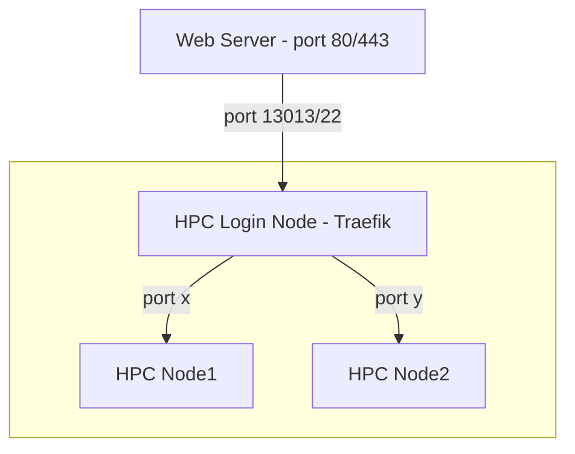

# Forever Slurm

Use the Traefik proxy to keep (web) services highly available on Slurm-managed HPC clusters. (Web) services run as Slurm batch jobs that end when time expires, so user requests may fail unless other jobs take over. Traefik provides load balancing and failover for multiple identitical Slurm jobs. Since port numbers may vary across nodes, we use random ports stored in the Slurm job's comment field, enabling simple service discovery without the need for extra complex message queue or service discovery software. Please also check this [background article on Medium](https://dirk-petersen.medium.com/run-web-services-on-hpc-stupid-63e208008da8)

## What does this look like ?



Traefik simply runs as a --user systemd service on the login node and the web server can either connect directly to the Traefik proxy or use a simple ssh port forwarding tunnel to the HPC login node 

## Install / Config

login to your HPC system (login-node), clone the forever-slurm repository (either via git or if you don't have keys setup in github use https `git clone https://github.com/dirkpetersen/forever-slurm`) and run config.sh

```
git clone git@github.com:dirkpetersen/forever-slurm.git
cd forever-slurm
./config.sh 
```

This will have Traefik listen on the port you select (default: 13013) and configure your environment under forever-slurm/.work. For testing make sure you pick the hello-python service here :

```
Which services do you want to add?

1) a100-llama-cpp-server
2) hello-python
3) llama-cpp-server
4) Done
#?
```
and enter at least 2 instances for the question that follows.

After that forever-slurm launches 2 user level systemd services and you can check the output files to verify everything is working 

```
tail ./forever-slurm/.work/log/traefik.log
tail ./forever-slurm/.work/log/forever-traefik.service.log (mostly empty)
tail ./forever-slurm/.work/log/forever-slurm.service.log
tail ./forever-slurm/.work/slurm-output/hello-python.out
```

To confirm that forever-slurm is setup correctly, run this curl command multiple times on the login node: 

```
$ curl -i http://127.0.0.1:13013/hello-python/tests

HTTP/1.1 200 OK
Content-Type: text/html
Date: Wed, 25 Sep 2024 17:50:50 GMT
Server: SimpleHTTP/0.6 Python/3.12.5
Transfer-Encoding: chunked

Hello, Python from xnode-11-5:37422 ! You accessed: http://10.96.39.11:37422/tests
```
Each time you run it you should see a different node hostname and port. This is the Traefik load balancer at work.

### Configuring a Llama LLM inference server

One of the best use cases for forever-slurm is running a number of large language model (LLM) inference servers, for example as a backbone for your own on-premises ChatGPT. The Slurm submission script `./services/a100-llama-cpp-server/a100-llama-cpp-server.sub` has detailed instructions on how to install the pre-requisites for llama-cpp-python

## Setting up new compute services 

The folder `./forever-slurm/services` has a number of examples that you can activate. Each folder represents a service name that, if installed, you can reach via url, e.g. `http://127.0.0.1:13013/my-service-name/v1/blabla`. Minimally a service requires an HPC (Slurm) job script (bash, python, etc) that must have an extension *.sub and a Traefik service configuration file that must have the extension *.yml. Other rules that apply: 

* A service name in either file cannot have any spaces, just hyphens
* Both file names need to start with the service name but can have extra characters, e.g. hello-python-yada.sub or hello-python-aah.yml
* The Traefik yml file must have the exact service names in PathPrefix and under stripPrefix (see hello-python.yml)
* The Slurm sub script file must have the exact service name as job name, e.g. `#SBATCH --job-name "hello-python"` 
and it must update the `Comment` field of the current job. (see hello-python.sub)

Once you have a Slurm job running, you can check if it has the correct `Comment` field, for example running the below `scontrol` command on job 123456 should return something like this: 

```
$ scontrol show job 123456 | sed -n 's/.*Comment=\([^[:space:]]*\).*/\1/p'

traefik,hello-python,http://xnode-13-20:26279

```
You can also check the status of the 2 systemd services installed by ./config.sh: 

```
systemctl --no-pager --user status forever-slurm forever-traefik
```

When you run `./config.sh` the required environment variables will be copied from file .env.default to .env and you are prompted to confirm or edit each value. The variable SERVICE_LIST defines all active services and the number of instances that are expected to run. forever-slurm will continue to submit jobs until the total number of running and pending jobs is equal to the number behind the forward slash.

```
SERVICE_LIST: "hello-python/2 llama-cpp-server/2 a100-llama-cpp-server/1"
```

If you have a new compute service please add it to the services folder send me a pull request so others can benefit from your work. 


## Setup an SSH tunnel / port forward 

If you cannot reach the Traefik port on the HPC login node from the frontend web server outside your HPC cluster, you need to setup SSH port forwarding. 

Login to your frontend web server and switch to the user account you would like to have port forwarding run under (not root)

Clone the forever-slurm respository just like above, cd to forever-slurm and then run: 

```
./config.sh --ssh
```

After answering a few questions (e.g. what is the host name of your HPC login node and the username for that node) you will be asked to add a public key on your HPC login node BEFORE hitting any key.

If you run into issues check 

```
tail -n 25 ./forever-slurm/.work/log/forever-ssh-forward.service.log
```

You can always check the status of the systemd service: 

```
systemctl --no-pager --user status forever-ssh-forward
```

In some cases, systemctl commands may not work, for example if you switched to the current account from another account (`su -`), make sure that DBUS_SESSION_BUS_ADDRESS is set, you might have to add the below to the ~/.bashrc of the service account where you install forever-slurm 

```
export DBUS_SESSION_BUS_ADDRESS=${DBUS_SESSION_BUS_ADDRESS:-unix:path=/run/user/$(id -u)/bus}
```
