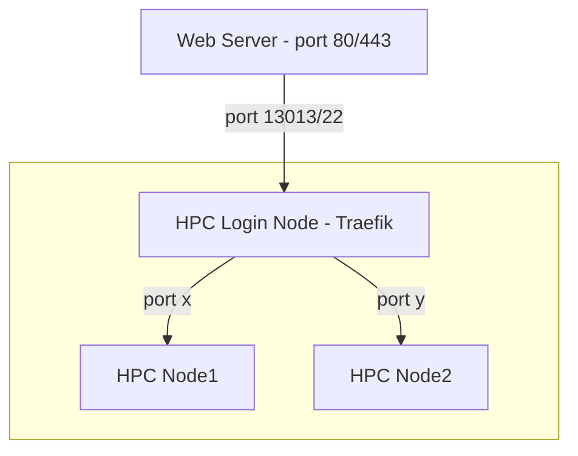

# Forever Slurm

Use the Traefik proxy to keep (web) services highly available on Slurm-managed HPC clusters. (Web) services run as Slurm batch jobs that end when time expires, so user requests may fail unless other jobs take over. Traefik provides load balancing and failover for multiple identitical Slurm jobs. Since port numbers may vary across nodes, we use random ports stored in the Slurm job's comment field, enabling simple service discovery without the need for extra message queue or serice discovery software.


## What does this look like ?



Traefik simply runs as a --user systemd service on the login node and the web server can either connect directly to the Traefik proxy or use a simple ssh port forwarding tunnel to the HPC login node 

## Installing 

login to your HPC system, clone the forever-slurm repository and run install.sh

```
git clone git@github.com:dirkpetersen/forever-slurm.git
cd forever-slurm
./install.sh 
```

If you have not setup ssh keys for github you can also clone it via https: `git clone https://github.com/dirkpetersen/forever-slurm.git`

## Configuring 

